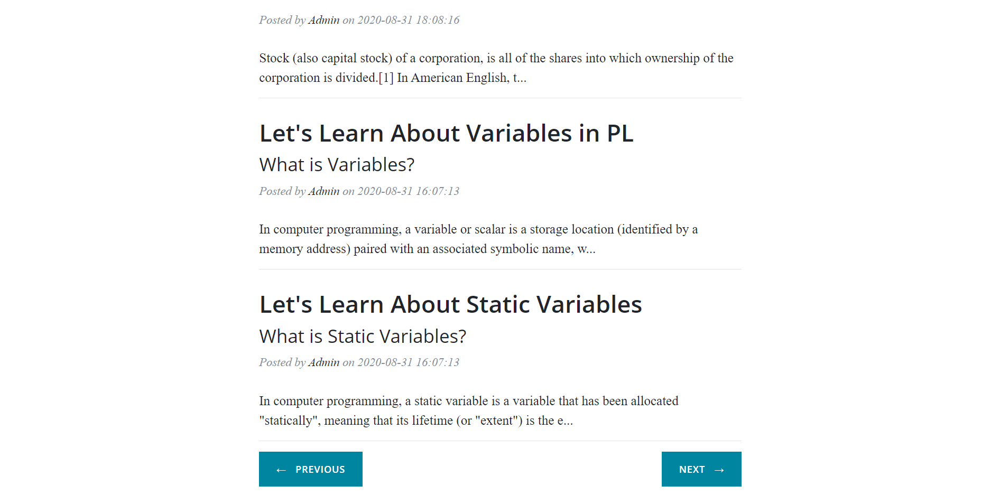
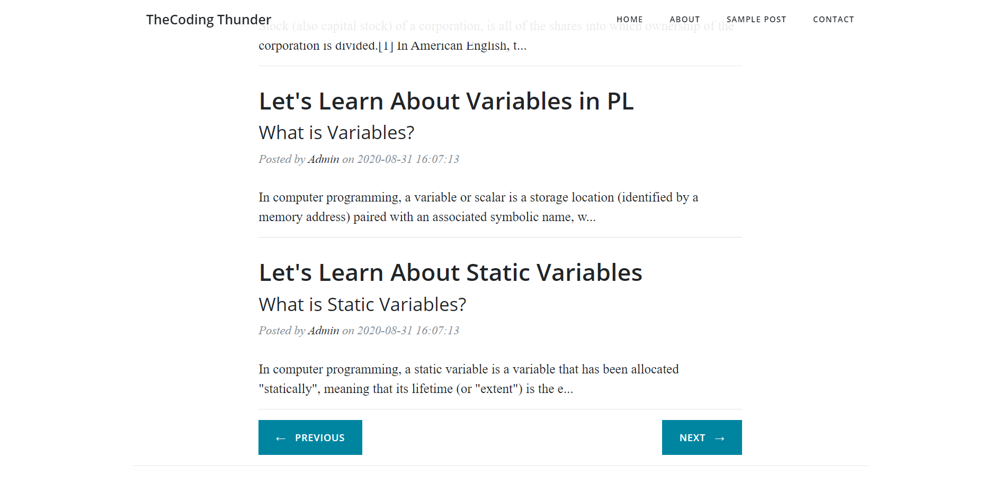
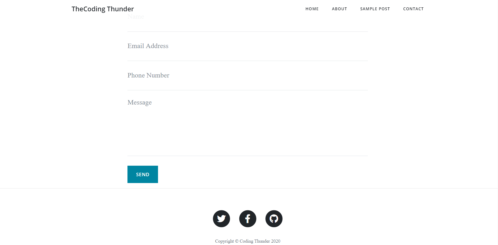

# flask_blog
A Simple Blog App to Add a Blog.

# How to Use
# 1) Package Requirements :)
first import required package of python by following command on command prompt:
```
  pip install flask
  pip install flask-mail
  pip install Flask-SQLAlchemy
```
# 2) Software Requirements :)
install Xampp or Wampp sever on your PC
then Create a Database Called codingthunder and create two tables posts and contacts
inside posts table we have 
```
  sno, title, tagline, slug, content, img_file, date --> This Attributes
```

and inside comments table we have 
```
  sno, name, phone_num, msg, date, email  --> This Attributes
```

# 3) Download the Source Code :)

clone this repository by following Command.
```
  git clone https://github.com/harikanani/flask_blog.git
```
goto the file location
```
  cd flask_blog
```
and then open Command Prompt there and type following command
```
  python main.py
```

# Output Screens
# HomePage


# HomePage With Blogs



# AboutPage


# Contact Us Page


